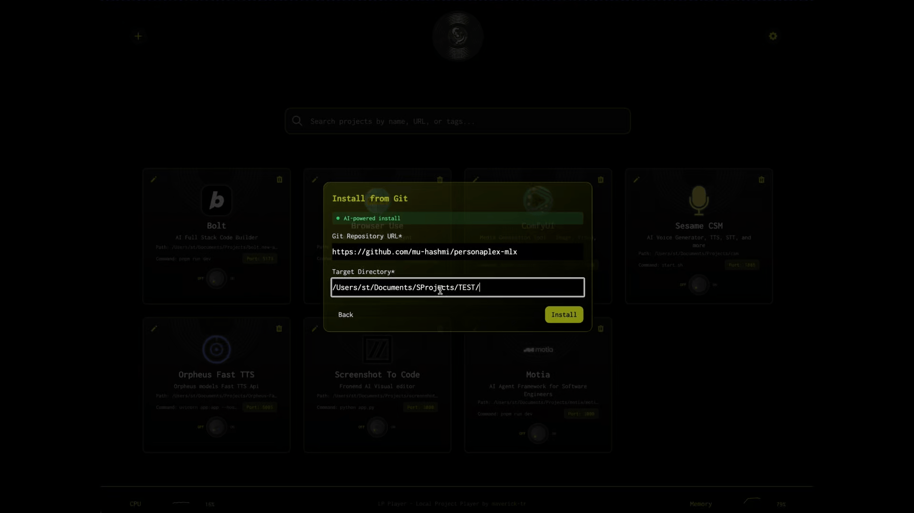
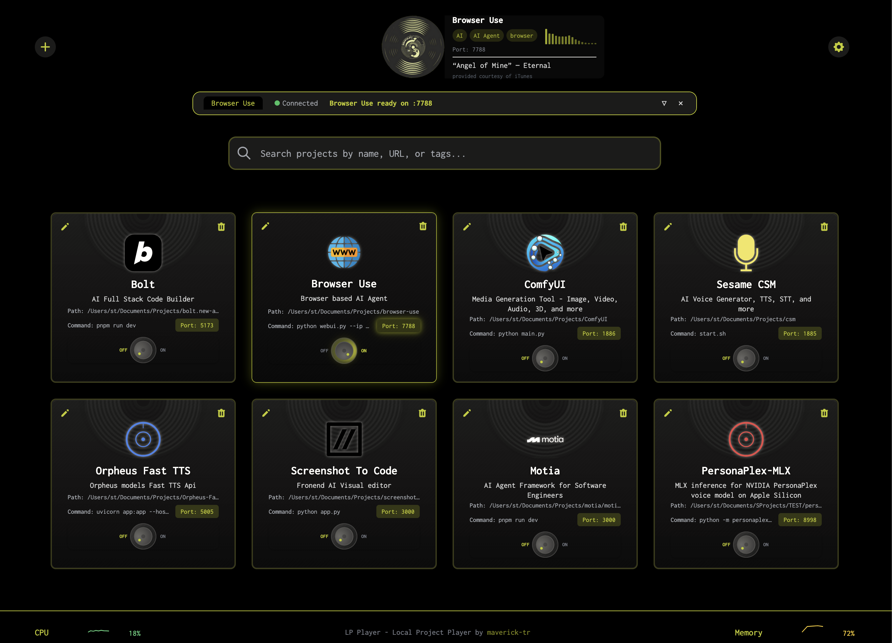
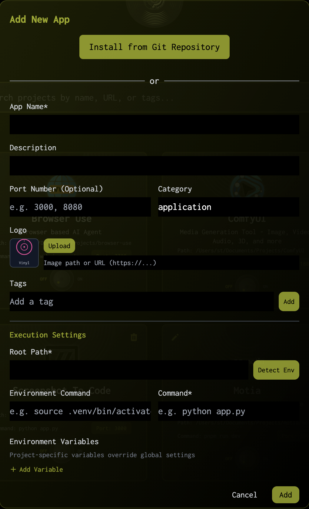

<p align="center">
  
</p>

<h1 align="center">LP Player</h1>
<p align="center"><em>Local Project Player</em></p>

<p align="center">
  Your local apps. One dashboard. <strong>Zero friction.</strong><br/>
  A free, open-source project manager for local development apps.<br/>
  <a href="https://lp-player.sh">lp-player.sh</a>
</p>

<p align="center">
  <a href="https://lp-player.sh"></a>
  <a href="https://www.npmjs.com/package/lp-player"></a>
  <a href="https://www.npmjs.com/package/lp-player"></a>
  <a href="https://github.com/maverick-tr/lp-player/releases/latest"></a>
  <a href="https://github.com/maverick-tr/lp-player/stargazers"></a>
  <a href="LICENSE"></a>
</p>

<p align="center">
  <a href="#features">Features</a> · <a href="#install">Install</a> · <a href="#screenshots">Screenshots</a> · <a href="#getting-started">Getting Started</a> · <a href="#contributing">Contributing</a>
</p>

<br/>

<p align="center">
  
</p>
<p align="center"><em>Add your projects, hit play, and go.</em></p>

<p align="center">
  
</p>
<p align="center"><em>AI-assisted setup — paste a GitHub URL and let AI handle the rest.</em></p>

<br/>

## What is LP Player?

LP Player is a centralized dashboard for managing and running all your local development projects. Register any app — Python, Node.js, Go, anything — start and stop it with one click, monitor terminal output in real time, and let AI handle the boring setup.

No more juggling terminal tabs, forgetting launch commands, or re-reading READMEs. One place for everything.

<br/>

## Features

**One-Click Launch** — Start any project instantly. Search across all your apps by name, tags, or category.

**Real-Time Terminal** — Live output streaming with full ANSI color support. Multiple tabs, one unified view.

**AI-Assisted Setup** — Point to a GitHub repo. AI reads the README, detects the stack, installs dependencies, and configures everything automatically.

**Smart Detection** — Auto-detects Python venv, Conda, Node.js environments and fills activation commands for you.

**Port Management** — Detects port conflicts before you run. Click to open running apps in your browser.

**System Monitoring** — CPU and memory usage at a glance in the footer. Know when your machine is struggling.

**Beautiful UI** — Vinyl record-inspired app cards with auto-generated colorful icons, smooth Framer Motion animations, dark/light themes, sepia filters, and hue rotation.

**Sound Effects** — Optional vinyl crackle and retro sound effects for a unique experience.

**Cross-Platform** — Works on macOS, Windows, and Linux. Available as npm package, standalone binary, DMG, or Windows installer.

<br/>

## Screenshots

<!-- Replace with your own screenshots -->
<p align="center">
  <br/>
  <em>The main dashboard with your projects</em>
</p>

<p align="center">
  <br/>
  <em>Add apps manually or let AI do it from a GitHub URL</em>
</p>

<br/>

## Install

### Quick Start (no install needed)

```bash
npx lp-player
```

### npm (global install)

```bash
npm install -g lp-player
lp-player
```

### Shell Script (standalone binary)

```bash
curl -fsSL https://raw.githubusercontent.com/maverick-tr/lp-player/release/install.sh | bash
```

### Download

| Platform | Download |
|----------|----------|
| macOS (Apple Silicon) | [LP-Player.dmg](https://github.com/maverick-tr/lp-player/releases/latest/download/lp-player.dmg) |
| macOS (Intel) | [lp-player-macos-x64](https://github.com/maverick-tr/lp-player/releases/latest/download/lp-player-macos-x64) |
| Windows | [LP-Player-Setup.exe](https://github.com/maverick-tr/lp-player/releases/latest/download/LP-Player-1.0.0-Setup.exe) |
| Linux (x64) | [lp-player-linux-x64](https://github.com/maverick-tr/lp-player/releases/latest/download/lp-player-linux-x64) |

> All releases are hosted on [GitHub Releases](https://github.com/maverick-tr/lp-player/releases) — fully transparent, no tracking.

> **macOS users:** If you see _"LP Player is damaged and can't be opened"_, run this once after installing:
> ```bash
> xattr -c /Applications/LP\ Player.app
> ```
> This removes the macOS quarantine flag applied to downloaded apps that aren't signed with an Apple Developer certificate.

<br/>

## AI Provider Compatibility

LP Player's AI-assisted setup works with any provider that exposes an OpenAI-compatible API (`/v1/chat/completions`). Configure the API URL, key, and model in **Settings → AI**.

| Provider | API URL | Example Models |
|----------|---------|----------------|
| OpenAI | `https://api.openai.com/v1` | gpt-4o, gpt-4o-mini, o3-mini |
| Anthropic (via proxy) | `https://api.anthropic.com/v1` | claude-sonnet-4-20250514 |
| Google Gemini | `https://generativelanguage.googleapis.com/v1beta/openai` | gemini-2.0-flash, gemini-2.5-pro |
| Ollama (local) | `http://localhost:11434/v1` | llama3, codellama, mistral |
| LM Studio (local) | `http://localhost:1234/v1` | Any loaded model |
| Groq | `https://api.groq.com/openai/v1` | llama-3.3-70b, mixtral-8x7b |
| Together AI | `https://api.together.xyz/v1` | meta-llama/Llama-3-70b |
| OpenRouter | `https://openrouter.ai/api/v1` | Any model via OpenRouter |
| Mistral AI | `https://api.mistral.ai/v1` | mistral-large, codestral |
| DeepSeek | `https://api.deepseek.com/v1` | deepseek-chat, deepseek-coder |
| Any OpenAI-compatible | Your custom URL | Any compatible model |

> **No real API key needed** for local providers like Ollama and LM Studio — just enter any placeholder value (e.g. `12345`) as the field is required.

<br/>

## Getting Started

LP Player opens automatically when launched. If it doesn't, browse to `http://localhost:4243` — this is the default port.

### 1. Set Your Default Projects Folder

Go to **Settings → Environment** and set your default projects directory (e.g. `~/Projects`). This enables autocomplete when adding apps and auto-fills paths for git cloning.

### 2. Configure AI (Optional)

Go to **Settings → AI** and add your API key for AI-assisted installations. LP Player can read a project's README, detect the tech stack, install dependencies, and configure everything automatically.

If you have [uv](https://docs.astral.sh/uv/) installed, enable "Prefer uv" for faster Python package installs.

### 3. Add Your First App

Click **"Add App"** and either:
- **Manual**: Enter the project path, run command, and optional environment activation command. LP Player auto-detects Python venvs, Conda environments, and Node.js setups.
- **From Git**: Paste a GitHub URL. LP Player clones the repo and sets it up.
- **AI Install**: Paste a GitHub URL and let AI handle everything — from cloning to dependency installation.

> **Tip:** Apps without a custom logo automatically get a colorful vinyl record icon — each one unique.

### 4. Hit Play

Click the power knob on any app card to start it. Terminal output streams in real time. Click the port number to open the app in your browser.

<br/>

## Development

### Prerequisites

- Node.js 18+
- npm

### Run from Source

```bash
git clone https://github.com/maverick-tr/lp-player.git
cd lp-player
npm install
./start.sh          # dev mode (frontend + API)
./start.sh prod     # production mode
```

Or using npm scripts:

```bash
npm run dev:api     # frontend on :4242 + API on :4243
npm run build       # production build
npm run prod        # build + serve on :4243
```

<br/>

## Tech Stack

| Layer | Technology |
|-------|-----------|
| Frontend | React 18, Vite, Tailwind CSS, Framer Motion, Headless UI |
| Backend | Node.js, Express, WebSocket (ws) |
| Process Management | Child Process API with real-time streaming |
| Data | JSON file persistence with triple-fallback (cache → localStorage → API → file) |
| Font | Inconsolata (monospace) |

<br/>

## Contributing

Contributions are welcome! See [CONTRIBUTING.md](CONTRIBUTING.md) for setup instructions and guidelines.

1. Fork the repo
2. Create a feature branch
3. Make your changes
4. Submit a Pull Request

<br/>

## License

[MIT License](LICENSE) — free to use, modify, and distribute © [maverick-tr](https://github.com/maverick-tr).

<br/>

---

<p align="center">
  <sub><a href="https://lp-player.sh">lp-player.sh</a></sub>
</p>
